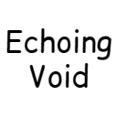

<p align="center">
  
</p>

<h1 align="center">Echoing Void</h1>

<p align="center">
  <b>Le DLC "Echoing Void" de Minecraft Dungeons, réinventé dans l'End.</b><br>
  Un mod Fabric qui ajoute une nouvelle biome, des ennemis inédits, deux armes légendaires<br>
  et une progression d'équipement au-delà de la Netherite.
</p>

<p align="center">
  
  
  
  
</p>

---

## À propos

**Echoing Void** transpose l'ambiance du DLC *Echoing Void* de Minecraft Dungeons directement dans la dimension de l'End. Aux confins de l'archipel, au-delà des îles habituelles, un nouveau vide vous attend : des créatures qui vous observent, un liquide toxique qui ronge les âmes, et un minerai plus dur que la Netherite qui n'attend que d'être forgé.

Pensé pour les joueurs qui ont fini le end-game vanilla et cherchent un nouvel objectif, ce mod ajoute un contenu complet, cohérent et intégré nativement à l'expérience Minecraft — sans dénaturer le jeu de base.

## Points forts

- **Une nouvelle biome de l'End** — les *Void Islands*, un archipel resserré taillé pour le parkour, entièrement bâti en Void Stone.
- **Deux ennemis inédits** — le *Watchling*, qui vous observe avant de frapper, et le *Blastling*, qui vous arrose de projectiles à distance.
- **Un liquide maudit** — le *Void Liquid*, qui empoisonne quiconque s'y attarde trop longtemps.
- **Une progression au-delà de la Netherite** — le minerai *Enderite*, une chaîne complète d'outils, d'armes et d'armures qui surclassent leurs équivalents vanilla.
- **Deux armes légendaires** — *The Beginning and The End* (épée à combo) et *Call of the Void* (arc chargeable), chacune avec ses propres effets sonores et visuels.
- **Un enchantement exclusif** — *Void Strike*, disponible à la table d'enchantement, à l'enclume et dans le butin des End Cities.
- **Une brasserie dédiée** — l'*End Brewing Stand*, seule capable de préparer la Potion of Void Poisoned.
- **Intégration complète** — recettes, loot tables, tags, avancements compatibles, et support JEI en option.

Toute la documentation technique (blocs, objets, recettes, mobs, génération de monde, mixins…) est disponible dans le [**wiki**](wiki.md).

## Installation

1. Installer [Fabric Loader](https://fabricmc.net/use/) (0.19.3 ou supérieur) pour Minecraft **26.1.2**.
2. Installer [Fabric API](https://modrinth.com/mod/fabric-api).
3. Installer la dépendance **Nuit** (gestion du ciel, anciennement FabricSkyboxes).
4. Placer le fichier `.jar` du mod dans le dossier `mods` de votre installation.
5. (Optionnel) Installer **JEI** pour profiter des recettes intégrées (brassage End, etc.).

## Pour les développeurs

Ce projet est basé sur le template officiel Fabric. Pour la mise en place d'un environnement de développement, consultez la [documentation Fabric](https://docs.fabricmc.net/develop/getting-started/creating-a-project#setting-up) correspondant à votre IDE.

```
./gradlew build
```

## Crédits & Licences

- Le **code source** de ce mod est publié sous licence **CC0-1.0** (voir [LICENSE](LICENSE)) — libre de réutilisation, y compris à des fins commerciales.
- Les **musiques** incluses dans ce mod (*Broken Citadel*, *End Wilds*, *Ethereal Blocks*, *Obsidian Gate Tower*, *Ship*, *Tower*) sont extraites de la bande originale de **Minecraft Dungeons** et restent la **propriété exclusive de Mojang Studios / Microsoft**. Elles sont utilisées ici à titre non commercial, en hommage au DLC *Echoing Void*, et ne sont couvertes par aucune licence de ce dépôt.
- **Minecraft** et **Minecraft Dungeons** sont des marques déposées de Mojang Studios / Microsoft. Ce mod est un projet de fan, non officiel et non affilié à Mojang ou Microsoft.
